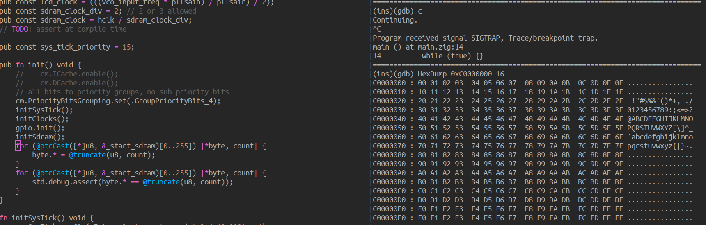
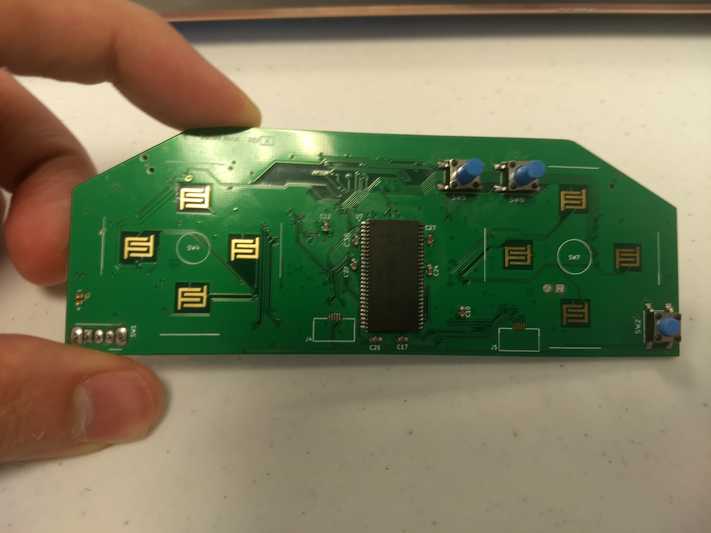
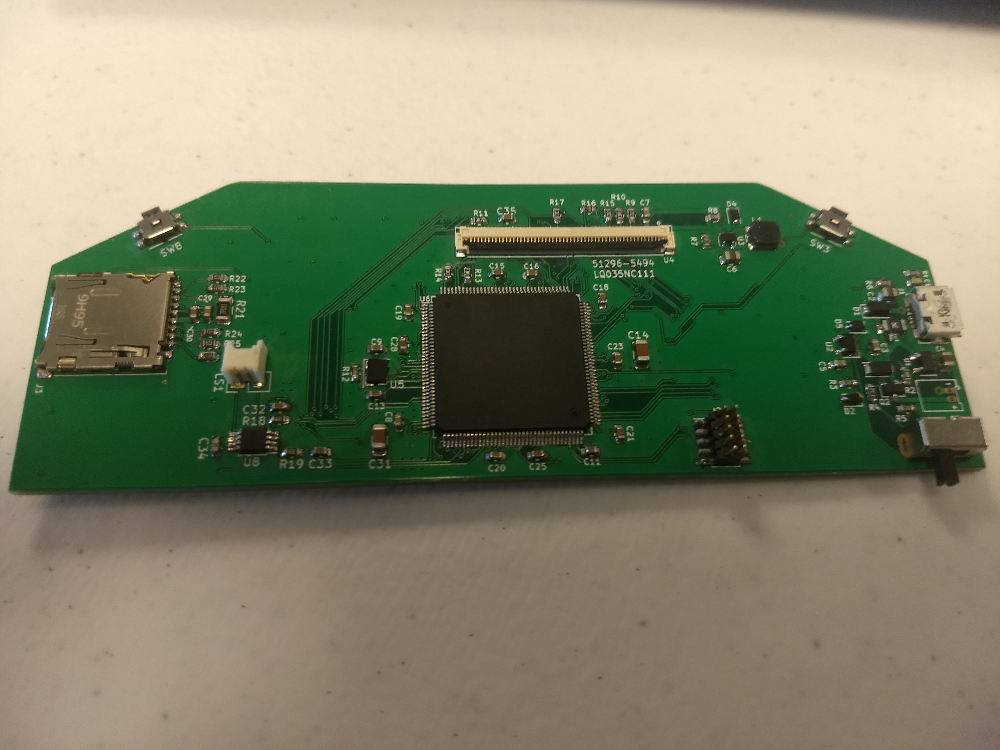
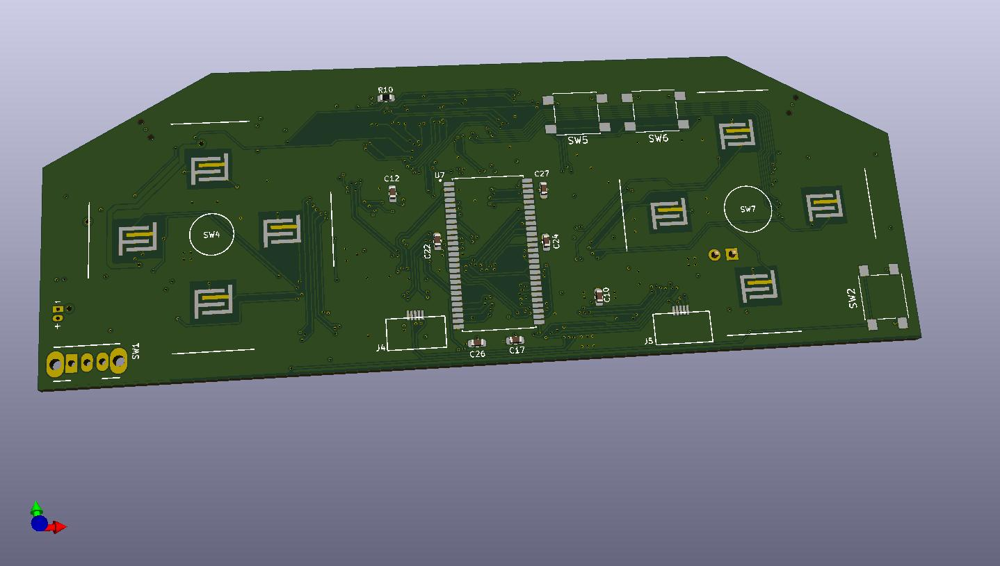

# BurnedHead

A handheld, portable video game system designed with Kicad and programmed in the
Zig programming language.

# Description

The processor is the STM32F767ZG, a Cortex-M7 processor selected for the ample
size of the instruction and data caches.  Currently at the board bring-up stage,
the functionality includes an RGB parallel interface, an MMC card socket, a 32MB
SDRAM clocked at 108MHz, D-pad, 4 front facing buttons, 2 shoulder buttons, 2
joysticks, and a speaker. The device is powered through a Micro-USB connector or
a rechargeable LiPo battery for portability.

The final product will load user-selectable ELF files off of the MMC compatible
card into the external RAM and run them as a process.

The device headers in the Zig programming language were generated from SVD files
and the CMSIS equivalent functionality for ARM-v7m was also written in Zig.

There is only one line of assembly in the project due to a current bug in the
Zig compiler, which sets the stack pointer address entry in the interrupt
handlers.

There are only two units in existence currently, but revision 1 will bring
significant PCB updates and be assembled at the factory, so a minimum order
quantity will have to be met. This project is intended solely to advance the
usage of the Zig programming language in the embedded space and is not for
profit. I will inform the Zig Discord server of the extras and mail out the new
PCBs to anyone willing to pay the amortized cost of a PCB and shipping.

# Building

BurnedHead tries to keep up with the tip of the [Zig](https://www.ziglang.org) master
branch.

[Latest Tested Commit](https://github.com/ziglang/zig/commit/083c0f1cebc763e4e43529b50f6df9839c32c1c7)

## Cloning the Repository

This repository uses submodules to manage dependencies and loosely tie together
the multiple ongoing Zig projects required to implement bare-metal support for
Arm targets in Zig.

```bash
git clone --recurse-submodules https://github.com/vegecode/BurnedHead.git
```

## Building the Application

BurnedHead uses the zig build system. Assuming the zig compiler is in your PATH,
navigate to the base directory of the clone, and:

```bash
zig build

```

The resulting executable is `./zig-cache/bin/executable.elf`

# Debugging on the Target

Debugging is done using GDB in a shell with the JLink GDBServer providing the
connection to the remote target. Running the shell script
`firmware/debug/start_debug` will start the GDBServer and connect GDB to it,
then a gdb script loads the executable and sets a temporary breakpoint at the
reset handler.

A sample of some external RAM tests during board bring-up in a Vim/GDB session:


Another easy alternative if you are using a JLink debug probe is to use Ozone,
the standalone debugger from Segger or Segger Embedded Workbench which are
both free to use for non-commercial purposes.

Integrating with Eclipse should also be possible using the MCU GNU Eclipse
plugins.

# Hand-Assembled Revision 0 Board

The back of the first revision of the board was assembled using solder paste and
a cast-iron skillet over a stand-alone burner for reflow. Some rework was
required as applying the paste without a stencil resulted in uneven application.
The front side components were hand soldered.





# Renders




# Attributions

Some symbols and footprints  came from www.snapeda.com. See the library folder for the required
license and attributions.
