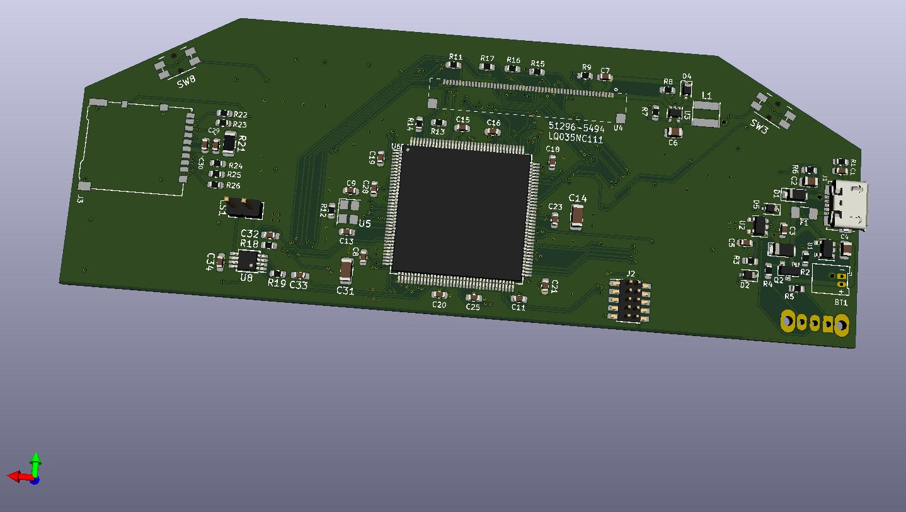

# BurnedHead

A handheld, portable video game system designed with Kicad and programmed in the
Zig programming language.

# Description

 The processor is the STM32F767ZG, a Cortex-M7
processor selected for the ample size of the instruction and data caches.
Currently at the board bring-up stage, the functionality includes an RGB
parallel interface, an MMC card socket, a 32MB SDRAM clocked at 108MHz, D-pad, 4
front facing buttons, 2 shoulder buttons, 2 joysticks, and a speaker. The device
is powered through a Micro-USB connector or a rechargeable LiPo battery for
portability.

The final product will load user-selectable ELF files off of the MMC compatible card into the external RAM and run them as a process.

# Building

BurnedHead tries to keep up with the tip of the Zig (www.ziglang.org) master branch.
[Latest Tested Commit](https://github.com/ziglang/zig/commit/083c0f1cebc763e4e43529b50f6df9839c32c1c7)

## Cloning the Repository

```bash
git clone --recurse-submodules https://github.com/vegecode/BurnedHead.git
```

## Building the Application

BurnedHead uses the zig build system. Assuming the zig compiler is in your PATH,
navigate to the base directory of the clone, and:

```bash
zig build

```

The resulting executable is `./zig-cache/bin/executable.elf`

# Debugging on the Target

TODO

# Hand-Assembled Revision 0 Board


# Renders




# Attributions

Some symbols and footprints  came from www.snapeda.com. See the library folder for the required
license and attributions.
